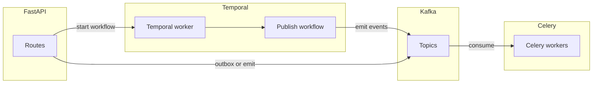

# SmartCourse — Concepts Q&A

Running log of questions asked during the project. Auto-appended each session.

---

## Session 1 — 2026-05-06/07

---

### Q: What are the alternatives to Docker Compose and their tradeoffs?

**A:**

| Tool | Best For | Avoid If |
|---|---|---|
| **Docker Compose** | Local multi-service dev, standard choice | You need K8s parity |
| **Podman Compose** | Rootless/daemonless Linux setups | Mac development |
| **Tilt** | Teams needing live UI + hot reload loops | Solo projects — overkill |
| **Skaffold** | Kubernetes-native CI/CD dev loops | You're not targeting K8s |
| **minikube/kind** | Max production parity with K8s | Week 1 — too much complexity |
| **Nix/devenv** | Reproducible environments without containers | Most teams — niche skill |
| **Testcontainers** | Spinning up services inside tests | Running the full app |

**Decision for SmartCourse:** Docker Compose for running the stack + Testcontainers for the test suite.

---

### Q: How does Docker work?

**A:**

- **Image** — a read-only, layered snapshot of a filesystem (blueprint)
- **Container** — a running instance of an image; an isolated process, not a VM
- **Dockerfile** — instructions to build an image layer by layer
- **Volume** — persistent storage that survives container restarts
- **Network** — containers talk to each other by service name, not localhost
- **Docker Compose** — orchestrates multiple containers with one command

Each image layer is cached. Only changed layers rebuild — keeping builds fast.

---

### Q: What are the major cons of Docker?

**A:**

1. **Heavy on Mac/Windows** — Docker runs a Linux VM underneath. 4–8 GB RAM overhead just idle.
2. **Slow volume mounts on Mac** — file sync between Mac filesystem and VM causes 1–3s hot reload delays.
3. **Ephemeral by default** — `docker-compose down` without `-v` caution deletes your DB data.
4. **Image bloat** — images pile up fast. 15–30 GB disk after a few weeks. Run `docker system prune` regularly.
5. **Networking complexity at scale** — `depends_on` only waits for container start, not service readiness.
6. **Docker daemon runs as root** — security risk if misconfigured.
7. **Not production-representative** — Compose is a dev tool. Production uses Kubernetes, ECS, etc.
8. **Layer cache invalidation** — wrong Dockerfile order = full reinstall on every code change.

---

### Q: Why use Alpine images?

**A:**

Alpine Linux is a minimal OS — only ~5 MB base vs Ubuntu's ~80 MB.

- `postgres:15` = 375 MB → `postgres:15-alpine` = 80 MB
- Faster pulls, less disk, fewer pre-installed packages = fewer vulnerabilities
- Alpine is actually **more secure** than Ubuntu for infra containers

**Exception:** Don't use Alpine for your Python app container. Alpine uses `musl libc` instead of `glibc` — some Python packages fail to compile. Use `python:3.11-slim` (Debian-based, glibc-compatible) for the app.

**Rule:** Alpine for infra (Postgres, Redis, RabbitMQ). `slim` for Python app.

---

### Q: What is ZooKeeper and why did Kafka need it?

**A:**

Kafka is a cluster of broker nodes. Someone needs to answer:
- Which broker is the leader?
- Which brokers are alive?
- Which broker owns which partition?

ZooKeeper was a separate service Kafka relied on to answer these questions. Your stack was:

```
ZooKeeper (separate service) ← Kafka brokers ← Your app
```

**Problems:** Extra service to run, monitor, scale. Two systems to debug. Bottleneck at large scale.

---

### Q: What is KRaft mode?

**A:**

KRaft = Kafka Raft. Kafka's own built-in consensus protocol — replaces ZooKeeper entirely.

Kafka brokers now manage their own metadata using the Raft algorithm (same used in etcd, CockroachDB).

```
Before KRaft:               After KRaft:
ZooKeeper + Kafka (2 things) → Kafka only (1 thing)
```

In our compose file: `KAFKA_CFG_PROCESS_ROLES: broker,controller` — one process does both jobs.

**KRaft is responsible for:**
- Leader election (who's in charge if a broker crashes)
- Cluster membership (which brokers are alive)
- Topic/partition metadata (who owns what data)

Production-ready since Kafka 3.3. We use 3.6 — KRaft is the right default.

---

### Q: Where does ZooKeeper still matter?

**A:**

Still in use with:
- **Kafka < 3.3** — many companies haven't upgraded yet
- **Apache HBase** — big data storage, still ZooKeeper-dependent
- **Apache Hadoop** — legacy big data ecosystem
- **Enterprise legacy systems** — banks, telecoms running 2015–2019 stacks

If you join a company on Kafka 2.x, you'll see ZooKeeper. Not dead — just being phased out in new setups.

---

### Q: What is Bitnami? It wasn't in our guidelines — why use it?

**A:**

Bitnami (VMware/Broadcom) maintains well-configured Docker images for common open-source software.

**Why not the official Apache Kafka image:**
The official image requires manually writing `server.properties` config files and mounting them. Complex for no benefit.

**Bitnami Kafka:** Same Kafka software, configured via clean environment variables:
```yaml
KAFKA_CFG_PROCESS_ROLES: broker,controller
KAFKA_CFG_NODE_ID: 1
```

Same software, better packaging — like a phone with a case vs without.

**Tradeoff to be aware of:** Bitnami images sometimes lag a few days behind official releases. Not a concern for a dev environment.

If the mentor prefers the official image, we can switch — the compose config will just be longer.

---

### Q: How does Temporal + DB work? Is Temporal connected to the DB?

**A:**

Yes — Temporal stores **all its state in a database** (Postgres, MySQL, or Cassandra).

```
Your App
   │ gRPC
   ▼
Temporal Server ──── PostgreSQL
   │                 (stores: workflow state, history,
   │                  task queues, timers, signals)
   ▼
Your Worker Code
```

Temporal is a **durable execution engine**. Every workflow step is persisted to the DB. If the server crashes mid-workflow, it replays from DB on restart — that's how it guarantees completion.

**`temporalio/auto-setup` image:** Normally you'd run DB schema migrations manually before starting Temporal. `auto-setup` does this automatically on first start against your existing Postgres.

**Important:** Temporal does NOT touch your app's tables. It uses its own internal schema. Your users/courses/enrollments are completely separate.

---

### Q: What is Cassandra? How is it different from MySQL/Postgres?

**A:**

**Postgres = Excel spreadsheet**
- Rows and columns, fixed schema
- Tables JOIN together
- One main server
- Great for structured relational data

**Cassandra = a notebook spread across 10 buildings**
- Each building holds a copy of some pages
- No JOINs — look up by a specific key only
- Built from day one to scale across many machines
- Write-heavy workloads at massive scale

**Key difference in practice:**

```sql
-- Postgres: JOINs work
SELECT u.name, e.course_id FROM users u
JOIN enrollments e ON u.id = e.student_id WHERE u.id = 5

-- Cassandra: no JOINs — table is designed around one query pattern
SELECT * FROM enrollments_by_student WHERE student_id = 5
```

**When Cassandra wins:** Millions of writes per second, data spread across regions, simple key-based lookups.

**When Postgres wins:** Complex queries, JOINs, ACID transactions, structured relational data.

**For SmartCourse:** Postgres = source of truth (users, courses, enrollments). Cassandra/MongoDB = analytics and event data (write-heavy, simple lookups like lesson completion counts).

---

### Q: I prefer glibc over musl — what does that mean for the project?

**A:**

For the Python app container, use `python:3.11-slim` (Debian-based, glibc). Never use `python:3.11-alpine` (musl).

Alpine images are fine for infra services (Postgres, Redis, RabbitMQ) since those have tested Alpine builds. The app container must use slim/glibc to avoid package compilation failures.

---

### Q: Is Cassandra like sharding?

**A:**

Yes — but sharding is something you do **to** a database. Cassandra has it **built in by default**.

- **Postgres sharding:** You manually split data across servers. You manage the split, rebalancing, routing — painful and error-prone.
- **Cassandra:** Every row has a partition key. Cassandra automatically decides which node holds which partition. Add a node, data rebalances automatically.

```
Postgres sharding = you doing Cassandra's job manually
Cassandra = sharding is the default, built-in behavior
```

---

### Q: What does SmartCourse demand — SQL or Cassandra? Where does each fail?

**A:**

**Where PostgreSQL fails:**
- 500k+ writes per second — single node becomes a bottleneck
- Data spread across multiple regions — replication lag, split-brain
- Billions of rows — query performance degrades without heavy tuning
- Schema changes on huge tables — `ALTER TABLE` locks the table, causes downtime

**Where Cassandra fails:**
- JOINs — doesn't exist at all
- Complex filtering (`WHERE status = 'active' AND created_at > X`) — only works if those columns are in the partition key
- `SELECT COUNT(*)` — extremely slow
- Transactions across multiple rows — no ACID across partitions
- Unknown query patterns upfront — table design depends on knowing exactly how you'll query. Wrong design = rebuild everything
- Low volume apps — massive operational overhead for no benefit

**For SmartCourse specifically:**

Core data (users, courses, enrollments, progress) → **PostgreSQL only**. These are relational, need JOINs, need ACID transactions, need foreign keys. Cassandra can't do this cleanly.

Analytics (enrollments over time, completion rates, popular courses) → **PostgreSQL handles this fine** up to 50k concurrent users with proper indexes. Cassandra is only worth it at millions of events per second (Netflix-scale).

---

### Q: Do we need both Cassandra and MongoDB?

**A:**

No. The PRD says "MongoDB / Cassandra" — pick one, not both.

| | MongoDB | Cassandra |
|---|---|---|
| Data model | JSON documents, flexible schema | Wide-column, rigid partition key |
| Query flexibility | High — filter on any field | Low — must design around query |
| Write speed at scale | Good | Excellent |
| Operational complexity | Low–Medium | High |
| Good for | Semi-structured content, documents | Time-series, event logs, massive writes |
| Learning curve | Easy | Steep |

**Decision for SmartCourse:** Neither is needed in Weeks 1–3. PostgreSQL handles everything comfortably at this scale.

If one is added later, **MongoDB is the better fit** because:
- Course content (modules → lessons → chunks → text) is document-shaped — fits JSON naturally
- Flexible schema helps when content structure varies per course
- Integrates cleanly with the Part B embedding/RAG pipeline
- Much easier to operate than Cassandra

Cassandra would only make sense if analytics traffic hits a scale where Postgres read replicas aren't enough — a Week 3+ decision based on actual load, not upfront assumption.

---

### Q: What is GIN index?

**A:**

GIN = Generalized Inverted Index.

Normal B-tree index: one value → one row pointer.
GIN index: breaks content into tokens → maps each token to all matching rows.

```
GIN on title + description:
"python"   → rows 1, 5, 12
"basics"   → rows 5, 8
"learning" → rows 2, 7, 9, 12
```

When a student searches "python basics" — Postgres finds the intersection instantly. No table scan. Used for full-text search columns, JSONB columns, and array columns.

---

### Q: Is video streaming a requirement in the PRD?

**A:**

No. `content_type (video/text/pdf)` and `content_url` are from the Week 1 plan, not the PRD. The `content_url` is just a link to where a file is hosted (S3, CDN). SmartCourse stores the URL, not the video itself. No video infrastructure needed.

---

### Q: Do we need login/signup? The PRD doesn't mention it explicitly.

**A:**

Yes — it's implied everywhere. The PRD says "user registration with roles", "student enrollment", "instructors create courses". None of these work without knowing who is making the request.

Auth is foundational infrastructure. PRDs assume it exists without listing it.

Week 1 auth endpoints:
- `POST /api/v1/auth/register` — signup
- `POST /api/v1/auth/login` — returns JWT token
- `GET /api/v1/users/me` — who am I (reads JWT)

JWT token carries: `user_id`, `role`, `expires_at`. Every protected endpoint reads this from `Authorization: Bearer <token>` — no DB hit needed to identify the caller.

---

### Q: What is the difference between SQLAlchemy and psycopg (PostgreSQL driver)?

**A:**

They are different layers that work together — not alternatives.

```
FastAPI App → SQLAlchemy → psycopg → PostgreSQL
```

- **PostgreSQL** — the database server, stores data, understands SQL
- **psycopg** (psycopg2/psycopg3) — Python driver, connects to PostgreSQL, sends raw SQL strings
- **SQLAlchemy** — ORM, sits on top of psycopg, lets you use Python classes instead of writing raw SQL

SQLAlchemy does not replace psycopg. It uses psycopg underneath. You need both.

**Same query, three ways:**
```python
# Raw psycopg — get tuples back
cursor.execute("SELECT id, title FROM courses WHERE status = 'published'")

# SQLAlchemy ORM — get Python objects back
result = await db.execute(select(Course).where(Course.status == "published"))
courses = result.scalars().all()  # [<Course>, <Course>]
```

ORM advantages: SQL injection protection by default, Python objects not tuples, relationships work automatically (`course.modules`), refactoring changes one class not many SQL strings.

ORM disadvantages: complex aggregation queries are painful to write in ORM syntax, hides what SQL is generated (N+1 problem common for beginners), sometimes generates inefficient SQL.

Solution: use ORM for standard CRUD, drop to raw SQL for complex analytics queries via `db.execute(text("..."))`.

**Why psycopg3 (async) not psycopg2:**
psycopg2 is synchronous — blocks the FastAPI event loop while waiting for DB. psycopg3 is async — app handles other requests while waiting for DB response.

Stack used: `sqlalchemy[asyncio]` + `psycopg[async]` + `alembic` (reads SQLAlchemy models, generates migration files).

---

### Q: What is Mapped and mapped_column vs old Column()?

**A:**

SQLAlchemy 2.0 replaced `Column()` with `Mapped` + `mapped_column()` to add full Python type awareness.

Old style (don't use):
```python
id = Column(UUID, primary_key=True)         # no type info, no autocomplete
email = Column(String(255), nullable=False)
```

New style (what we use):
```python
id: Mapped[uuid.UUID] = mapped_column(UUID(as_uuid=True), primary_key=True)
email: Mapped[str] = mapped_column(String(255), nullable=False)
full_name: Mapped[str | None] = mapped_column(String(255))  # nullable
```

`Mapped[str]` = this attribute is always a string. Editor, mypy, and FastAPI all know this. Full autocomplete and type safety. `Mapped[str | None]` = nullable column.

---

### Q: What are SQLAlchemy dialects?

**A:**

Every database adds its own types on top of standard SQL. SQLAlchemy calls these extras "dialects."

```python
from sqlalchemy.dialects.postgresql import UUID, TIMESTAMPTZ
```

- `UUID` — PostgreSQL's native UUID type (16 bytes, stored efficiently, not as text)
- `TIMESTAMPTZ` — timestamp with timezone. Always stores in UTC, converts on read. Standard SQL `TIMESTAMP` has no timezone awareness.

`sqlalchemy` = generic SQL (works on any DB)
`sqlalchemy.dialects.postgresql` = Postgres-specific features

Using dialect types means Postgres stores data in its most efficient native format instead of falling back to text/varchar.

---

### Q: What do relationship() lines mean in SQLAlchemy models?

**A:**

Relationships let you navigate between connected tables in Python without writing JOINs manually.

```python
# In Certificate model:
enrollment: Mapped["Enrollment"] = relationship("Enrollment", back_populates="certificate")
student: Mapped["User"] = relationship("User")
course: Mapped["Course"] = relationship("Course", back_populates="certificates")
```

- `certificate.enrollment` → gives the full Enrollment object (SQLAlchemy runs the JOIN)
- `certificate.student` → gives the full User object
- `certificate.course` → gives the full Course object

`back_populates="certificate"` means the Enrollment model has a matching `enrollment.certificate` pointing back — linked both ways. Without `back_populates`, the relationship is one-directional.

Strings in quotes (`"Enrollment"`, `"User"`) = forward references to avoid circular imports at class definition time.

Practical effect:
```python
cert = await db.get(Certificate, cert_id)
print(cert.student.full_name)  # no manual JOIN needed
print(cert.course.title)
```

---

### Q: Where is it written that we need a separate analytics DB?

**A:**

Nowhere. That was an incorrect assumption. Neither the PRD nor the guidelines mention a separate analytics database.

Almost every analytics metric in the PRD comes from data already in the core Postgres tables:
- Total Students/Instructors → users table
- Total Courses Published → courses table
- Enrollments Over Time, Completion Rate, Avg Time to Complete, Most Popular Courses → enrollments table

No `analytics_events` table needed. No separate analytics DB. Query the existing tables directly.

"Failed Events / Workflow Issues" is the exception — it comes from Prometheus counters exposed by Celery workers, not from the DB at all.

---

### Q: Do observability tools (Prometheus, Grafana, Jaeger, OpenTelemetry) require schema changes?

**A:**

No. They operate completely outside your application database.

- **OpenTelemetry** — a library added to FastAPI. Wraps HTTP requests, DB queries, Kafka messages with trace context. Ships data elsewhere. No schema change.
- **Jaeger** — receives traces from OpenTelemetry, stores them in its own internal storage. You never write to Jaeger. No schema change.
- **Prometheus** — scrapes a `/metrics` endpoint your app exposes. Stores metrics in its own time-series DB. No schema change.
- **Grafana** — reads from Prometheus and Jaeger, draws dashboards. Touches nothing in your DB.

"Failed Events / Workflow Issues" metric = Prometheus counters incremented by Celery workers when tasks fail. Not stored in Postgres.

The only thing observability needs from your schema: timestamps on every table (created_at, updated_at, enrolled_at, completed_at) — which already exist.

**Final Week 1 schema — locked:**
users, courses, modules, lessons, enrollments, progress, certificates. Seven tables. Nothing else.

---

### Q: Why not put analytics in MongoDB instead of PostgreSQL?

> **⚠️ Partially superseded — 2026-05-14.** The conclusion *"analytics **metrics** → Postgres SQL"* still stands. But the closing line *"MongoDB's job is lesson_chunks"* does **not** — chunks moved to Postgres/pgvector and MongoDB's job became the raw interaction/event log. See **"Final storage architecture (resolved)"** at the end of this session log.

**A:**

MongoDB can handle analytics — but PostgreSQL wins for SmartCourse's specific metrics.

The PRD metrics are: counts, averages, group-bys, and JOINs between enrollments and courses. These are SQL-shaped problems.

| | PostgreSQL | MongoDB |
|---|---|---|
| COUNT, AVG, GROUP BY | Native clean SQL | Verbose aggregation pipeline |
| JOINs (course title + count) | Natural | `$lookup` — slow and awkward |
| Grafana integration | Native, first-class | Plugin required |
| Write speed | Good at our scale | Slightly faster, irrelevant |
| Schema flexibility | Fixed — fine for known metrics | Not needed for predictable metrics |

MongoDB wins for analytics only when: events have unpredictable shapes (flexible schema helps), or you're doing real-time stream processing. Neither applies here.

The data already lives in Postgres. The metrics are SQL problems. Grafana + Postgres is the standard pairing. No reason to move data to MongoDB just to query it differently.

MongoDB's job in this project is lesson_chunks storage — where it genuinely fits. Not analytics.

---

### Q: Why store analytics events in PostgreSQL? Is that in the PRD?

> **⚠️ Resolved — 2026-05-14.** This entry correctly deferred the storage decision; it has since been made. The granular **interaction/event log** lives in **MongoDB**; the **9 dashboard metrics** are SQL rollups in Postgres. See **"Final storage architecture (resolved)"** at the end of this session log.

**A:**

It is NOT explicitly in the PRD. The PRD lists analytics metrics that need to be computed but never specifies where to store them. Adding `analytics_events` to the Week 1 schema was an assumption — and a wrong one.

The PRD says: Week 3 — "Basic analytics metrics" + "Analytics pipeline initialized." That is when the analytics storage decision should be made, not Week 1.

Options for analytics storage (Week 3 decision):
- **PostgreSQL** — simple, aggregation queries easy (GROUP BY, COUNT, AVG). Risk: analytics writes competing with core data writes on same DB.
- **Redis** — blazing fast counters (INCR, ZADD). Not good for complex queries like avg completion time.
- **Kafka → sink** — events flow through Kafka, consumer writes to separate store. Decoupled but more infra.
- **Separate Postgres DB** — protects core DB from analytics load.

For SmartCourse's scale, Postgres is likely fine — but as a separate schema, decided in Week 3.

**Week 1 schema — final and clean:**
users, courses, modules, lessons, enrollments, progress, certificates. Nothing else.

---

### Q: What is the full Part A picture across all 3 weeks?

**A:**

**Week 1 — Identity + Course Structure**
Users, auth, JWT, roles, courses, modules, lessons CRUD. Foundation everything else sits on.

**Week 2 — The Two Core Workflows**

Enrollment workflow (synchronous + async):
```
POST /enroll →
  Postgres transaction: record enrollment + initialize progress  (sync, ACID)
  Kafka event: user.enrolled →
    Celery: update analytics counters  (async)
    Celery: send welcome notification  (async)
```

Publishing workflow (Temporal):
```
PATCH /courses/:id/publish →
  Set status = "processing"  (sync)
  Temporal workflow:
    Extract content chunks from lessons
    Store chunks for search
    Mark status = "published" only after all steps complete
    If any step fails → retry that step, not the whole workflow
```

Partial failures must not corrupt publishing — that's exactly what Temporal solves.

**Week 3 — Events + Workers + Observability**

Kafka events: `user.enrolled`, `course.published`, `lesson.completed`
Celery workers consume events: update analytics, send notifications, process content
Observability: OpenTelemetry → Jaeger (tracing), Prometheus → Grafana (metrics)
Failed events are surfaced as a dashboard metric, not just logged.

**One schema addition needed for full Part A:**

`analytics_events` table (event_type, user_id, course_id, occurred_at, metadata JSONB) — append-only event log, aggregated for dashboard metrics.

`content_chunks` does NOT belong in Postgres — that's MongoDB territory in Week 4.

---

### Q: What is the course hierarchy? What are modules and lessons?

**A:**

```
Course       → what a student enrolls in ("Complete Python Bootcamp")
  Module     → a logical chapter/section ("Week 1: Basics")
    Lesson   → individual learning unit ("Variables and Data Types")
               content_url → link to actual file on S3/CDN
```

A student completes lessons. All lessons done → enrollment complete → certificate issued.

---

### Q: Are chunks and embeddings the same thing? Where do they live?

> **⚠️ Superseded — 2026-05-14.** Chunks and embeddings are still separate *concepts*, but they no longer live in MongoDB — both moved to **Postgres + pgvector** (a chunk and its embedding are one row). See **"Final storage architecture (resolved)"** at the end of this session log.

**A:**

They are separate concepts and both belong in MongoDB (Week 4), not PostgreSQL.

**Lesson (Postgres, Week 1):** metadata — title, type, URL, order index.

**Chunk (MongoDB, Week 4):** the actual text of a lesson broken into smaller pieces (300–400 words each) for semantic search. One lesson = multiple chunks.

**Embedding (MongoDB/Vector DB, Week 4):** a numerical vector (array of ~1536 floats) representing a chunk's meaning. Used for similarity search in the RAG pipeline.

```
Postgres:  lessons row → { title: "Functions", content_url: "s3://..." }

MongoDB:   { lesson_id: "same-uuid", chunk_index: 0,
             text: "A function is a reusable block...",
             embedding: [0.023, -0.841, ...] }
```

The `lesson_id` in MongoDB references the Postgres lesson — that's the bridge between systems.

**Corrected schema ownership:**
- PostgreSQL: users, courses, modules, lessons, enrollments, progress, certificates, analytics_events
- MongoDB: lesson_chunks — raw text in Week 2, embeddings added in Week 4

---

### Q: Where does content get stored during the publishing workflow (Week 2)?

> **⚠️ Superseded — 2026-05-14.** The workflow steps are still right, but the storage target changed: raw chunks are written to **Postgres** (alongside their embeddings via pgvector), **not** MongoDB. MongoDB instead receives the interaction/event log. See **"Final storage architecture (resolved)"** at the end of this session log.

**A:**

The publishing workflow (Temporal, Week 2) does:
1. Validate course has modules + lessons
2. Extract text from lesson files (content_url points to file on S3/CDN)
3. Break text into chunks (~300 words each)
4. Store raw chunks in MongoDB
5. Mark course status = "published"

Storage split:
- Course status transitions → PostgreSQL
- Raw text chunks → MongoDB (Week 2, no embeddings yet)
- Embeddings added to same MongoDB documents → Week 4

MongoDB document lifecycle:
```
Week 2: { lesson_id, course_id, chunk_index, text, created_at }
Week 4: { lesson_id, course_id, chunk_index, text, created_at, embedding: [...] }
```

Same document, embedding field added later. No migration needed.

Why NOT PostgreSQL for chunks: chunks are unstructured text with no relational queries needed. MongoDB's document model fits naturally. Embeddings (1536-float arrays) are also better stored in MongoDB/vector DB than Postgres.

Why NOT defer chunking to Part B: PRD explicitly says chunking is part of the publishing workflow — "broken into components (modules, lessons, chunks)." Skipping it in Part A makes the publishing workflow incomplete.

Week-by-week storage:
| Week | Storage |
|---|---|
| Week 1 | PostgreSQL only |
| Week 2 | PostgreSQL (status, enrollments) + MongoDB (raw chunks) |
| Week 3 | PostgreSQL (analytics_events) |
| Week 4 | MongoDB (embeddings added to chunks) |
| Week 5 | MongoDB vector search for RAG |

---

### Q: What happens if we put core data in Cassandra and analytics in Postgres (reversed)?

**A:**

Both sides break simultaneously.

**Core data in Cassandra breaks because:**
- No UNIQUE constraints across partitions — duplicate enrollments possible under concurrent load
- No multi-row transactions — enrolling a student (write enrollment + initialize progress + update counter) can partially fail with no rollback
- Complex queries don't work unless you designed the table around that exact query upfront — wrong design means full table scan across all nodes

**Analytics in Postgres breaks because:**
- Analytics is write-heavy — millions of tiny inserts (lesson completed, page viewed, video paused) constantly
- Postgres VACUUM can't keep up at that volume — dead rows pile up, indexes bloat, writes slow down
- This slows your core DB too since they share infrastructure

The reversal takes away Postgres's strengths (transactions, flexible queries) and Cassandra's strengths (write throughput) at the same time.

---

### Q: Why does analytics need Cassandra? What's the real reason?

**A:**

Analytics data follows one pattern: write once, never update, read later in bulk.

Every event (lesson completed, page viewed) = one tiny write. At scale = millions of writes per second, constantly, forever.

**Why this kills Postgres:** Every Postgres write acquires locks, updates WAL, updates indexes, and eventually needs VACUUM to clean dead rows. Under millions of writes/second, VACUUM can't keep up, indexes bloat, locks pile up. The whole DB slows — including your core user/course queries.

**Why Cassandra handles it:** Cassandra uses an LSM Tree (Log-Structured Merge Tree). Writes go to an in-memory buffer, then flush to disk in batches. No locks, no VACUUM, no index contention. It handles massive write volume with barely any slowdown.

The tradeoff: Cassandra pays for fast writes by making reads harder. Complex queries and aggregations are painful. That's fine for analytics — you mostly ask simple questions like "how many completions today?", not complex JOINs.

Note: At SmartCourse's scale (tens of thousands of users), Postgres with proper indexes handles analytics fine. Cassandra is only worth it at 10M+ events/day.

---

### Q: What is the origin of Cassandra?

**A:**

Built at **Facebook in 2008** for inbox search. The problem: hundreds of millions of messages written daily — Postgres and MySQL couldn't handle the write volume.

Engineers combined two existing ideas:
- **Amazon Dynamo (2007)** — distributed key-value store, great for writes and availability
- **Google Bigtable (2006)** — wide-column storage, great for structured data at scale

They took Dynamo's distribution model + Bigtable's data model = Cassandra.

Open-sourced by Facebook in 2008. Apache took it over in 2010.

The name is from Greek mythology — Cassandra was the prophet who was always right but never believed. The engineers felt the same about their internal design decisions being dismissed.

**Key insight from origin:** Cassandra was built to solve ONE problem — massive write throughput across many machines with no downtime. JOINs don't exist because they'd require cross-node coordination, killing write speed. Everything about Cassandra flows from that original constraint.

---

### Q: Full comparison — MongoDB vs Cassandra vs PostgreSQL?

**A:**

**Storing the same data (course + modules + lessons):**

PostgreSQL: three tables linked by foreign keys, queried with JOINs.

MongoDB: one JSON document with modules and lessons nested inside. No JOINs needed.

Cassandra: a flat table designed around one specific query ("give me all lessons for course X"). Ask anything else — you need a new table.

| | PostgreSQL | MongoDB | Cassandra |
|---|---|---|---|
| Data model | Tables + rows | JSON documents | Wide-column rows |
| Schema | Strict | Flexible | Strict partition key |
| JOINs | Yes | No (embed instead) | No |
| Transactions | Full ACID | Single-document ACID | Limited |
| Write speed | Good | Good | Excellent |
| Read flexibility | Excellent | Good | Low — must match partition key |
| Scale model | Vertical + read replicas | Horizontal sharding | Horizontal, automatic |
| Best for | Relational, transactional data | Documents, content, catalogs | Time-series, events, massive writes |
| Operational complexity | Low | Low–Medium | High |

**Where each truly fails:**

PostgreSQL fails at: 1M+ writes/second, no natural relational structure, global multi-region writes.

MongoDB fails at: strict multi-document consistency, deeply relational data, extreme write volume.

Cassandra fails at: unknown query patterns upfront (wrong partition key = rebuild everything), aggregations (SUM/AVG/GROUP BY), small teams (high operational overhead), modest data volume.

**SmartCourse decision:**
- PostgreSQL → users, courses, modules, lessons, enrollments, progress
- MongoDB → course content documents, chunked lesson text (Week 4, feeds RAG pipeline)
- Cassandra → not needed at this scale
- Redis → caching, session data, Celery results

---

## Session 2 — 2026-05-08

---

### Q: Why do we need sessions for connecting to the database? Why not just use connections directly?

**A:**

A connection and a session are two different things.

**Connection** = the physical pipe between Python and PostgreSQL. TCP socket, authenticated, expensive to create (~50ms).

**Session** = a unit of work on top of a connection. Tracks what you've read, what you've changed, manages the transaction.

```
Connection = a phone line (the physical wire)
Session    = one phone call on that line (a conversation with a purpose)
```

Without a session, if you insert a user then fail inserting the enrollment, the user row stays — data is corrupted. The session gives you transactions — all-or-nothing. If anything fails, rollback() undoes everything cleanly.

In Node.js, transaction objects in libraries like Sequelize/Prisma serve the same purpose as SQLAlchemy sessions.

---

### Q: Why pool_size=10? Code without it — does that mean no pool?

**A:**

No — when you don't specify pool_size, SQLAlchemy defaults to pool_size=5, max_overflow=10. There is always a pool, just with default values. Specifying it explicitly makes the behaviour intentional and visible.

Without a pool: every request opens a new connection (50ms overhead) → closes it. Under load this is catastrophic.

With pool_size=10: 10 connections pre-opened at startup, reused across requests. Zero connection overhead per request.

pool_size=10 is conservative and safe for a single-worker dev setup. With multiple Uvicorn workers (e.g. 4), total connections = 4 × 10 = 40. Tune based on PostgreSQL's max_connections (default 100).

---

### Q: How does async work with the database? How does it relate to Uvicorn?

**A:**

Python runs on one thread with an event loop. The event loop manages multiple tasks — when one task is waiting (for DB response, network), it steps aside and another task runs.

**Sync DB (blocks everything):**
```
Request A → send query → WAITING (thread frozen) → no other requests served
```

**Async DB (asyncpg + AsyncSession):**
```
Request A → send query → "I'm waiting, event loop take over"
    Request B starts → sends its query → "I'm waiting too"
    Request C starts → sends its query → "I'm waiting too"
    DB responds to A → resume A → respond
    DB responds to B → resume B → respond
```

The `await` keyword is what yields control back to the event loop while waiting for PostgreSQL.

**Uvicorn** is the ASGI server that runs FastAPI and manages the event loop. FastAPI is just a framework — it needs Uvicorn to actually receive HTTP connections. You start it with `uvicorn app.main:app`. By default: 1 worker, 1 event loop.

```
Browser → HTTP → Uvicorn (manages event loop) → FastAPI (routing) → your route → SQLAlchemy → asyncpg → PostgreSQL
```

---

### Q: What is the difference between Python async and Node.js async?

**A:**

Both use a single-threaded event loop — architecturally very similar.

| | Node.js | Python FastAPI + Uvicorn |
|---|---|---|
| Default behavior | Async everywhere by default | Sync by default, async is opt-in |
| Event loop | libuv (C++) | asyncio (Python) |
| DB driver | pg, mysql2 (async native) | asyncpg (async native) |
| Server | Node IS the server | Uvicorn runs FastAPI |
| Blocking risk | Hard — must use *Sync methods deliberately | Easy — accidentally call any sync library and block |

Biggest risk in Python that doesn't exist in Node: accidentally calling sync code inside an async route blocks the entire event loop.

---

### Q: Examples of sync code accidentally blocking the async event loop?

**A:**

**time.sleep vs asyncio.sleep:**
```python
# WRONG — freezes event loop for 2s, no other requests served
time.sleep(2)

# RIGHT — yields control, other requests run during wait
await asyncio.sleep(2)
```

**HTTP calls:**
```python
# WRONG — requests library is sync, blocks
import requests
response = requests.get("https://api.example.com")

# RIGHT — httpx with async client, yields
import httpx
async with httpx.AsyncClient() as client:
    response = await client.get("https://api.example.com")
```

**Database:**
```python
# WRONG — sync SQLAlchemy session, blocks event loop
users = db.query(User).all()

# RIGHT — async session, yields while waiting for PostgreSQL
result = await db.execute(select(User))
```

**Password hashing (CPU-intensive):**
```python
# WRONG — bcrypt takes ~100ms on main thread, blocks event loop
hashed = bcrypt.hashpw(password.encode(), bcrypt.gensalt())

# RIGHT — run in thread pool, frees the event loop
loop = asyncio.get_event_loop()
hashed = await loop.run_in_executor(None, partial(bcrypt.hashpw, password.encode(), bcrypt.gensalt()))
```

**Effect of blocking:**
```
10 requests arrive, request 1 hits time.sleep(2)
→ all 10 wait behind it → total time: 20 seconds

10 requests arrive, request 1 hits await asyncio.sleep(2)
→ all 10 run in parallel → total time: ~2 seconds
```

In Node.js, sync blocking requires deliberate effort (fs.readFileSync, execSync). In Python, sync is the default — easy to accidentally block.

---

### Q: What is Gunicorn and how does it relate to Uvicorn in production?

**A:**

In development you run `uvicorn app.main:app --reload` — one process, one event loop.

In production:
```bash
gunicorn -w 4 -k uvicorn.workers.UvicornWorker app.main:app
```

- **Gunicorn** = process manager. Spawns and manages N worker processes. Handles crashes, restarts workers.
- **Uvicorn** = ASGI server inside each worker. Runs the event loop and handles async requests.

```
Client
  └── Gunicorn (process manager)
        ├── Worker 1 → Uvicorn → Event Loop → FastAPI → coroutines
        ├── Worker 2 → Uvicorn → Event Loop → FastAPI → coroutines
        ├── Worker 3 → Uvicorn → Event Loop → FastAPI → coroutines
        └── Worker 4 → Uvicorn → Event Loop → FastAPI → coroutines
```

4 workers × pool_size 10 = 40 total PostgreSQL connections. Set pool_size accordingly.

---

### Q: What is MVCC and how is it different from locks?

**A:**

**Traditional locks:** a writer locks a row → readers must wait. Poor concurrency under load.

**MVCC (Multi-Version Concurrency Control)** — PostgreSQL's approach:
- Every row update creates a new version of the row, not an overwrite
- Readers see the old version while writers are writing the new version
- Readers and writers never block each other

```
Transaction A (reading):  sees version 1 of the row
Transaction B (writing):  creates version 2 of the row simultaneously
No blocking — both proceed at the same time
```

MVCC is why PostgreSQL handles high concurrency well. The tradeoff: dead row versions accumulate and VACUUM must clean them up periodically.

---

### Q: What is WAL (Write Ahead Log) in PostgreSQL?

**A:**

WAL = Write Ahead Log. Before PostgreSQL writes data to the actual table files, it writes the change to a sequential log first.

Why: if the server crashes mid-write, the actual table files may be partially written (corrupted). On restart, PostgreSQL replays the WAL to restore consistency — data is never lost.

```
Transaction:
  1. Write change to WAL (sequential, fast)
  2. COMMIT confirmed to application
  3. Later: apply change to actual table files (background)
```

Sequential writes to WAL are fast (disks are fast at sequential I/O). Table file writes are random I/O (slower) — WAL lets you confirm the transaction before that slow step.

WAL also enables replication — replicas stream and replay the primary's WAL.

---

### Q: What is the Saga / Compensation pattern? How does it apply to SmartCourse?

**A:**

When a workflow has multiple steps and one fails mid-way, you need to undo the steps that already succeeded. This is compensation.

```
Publishing workflow:
Step 1: save course       → success
Step 2: process lessons   → success
Step 3: generate chunks   → FAILS

Compensation (run in reverse):
Undo Step 2: delete processed lesson data
Undo Step 1: revert course to draft
```

Without compensation: course is stuck in a corrupted "partially published" state.

Temporal supports this natively — each workflow step can define a compensation handler. Celery requires you to build this manually, which is error-prone.

This is why the publishing workflow uses Temporal (Week 2) while simple background tasks like analytics updates use Celery.

---

### Q: Kafka vs Celery — what is the real difference?

**A:**

They solve different problems and complement each other.

**Celery** — executes a task. One producer, one consumer. Task runs once.
```
FastAPI → Celery → "send welcome email to user 5" → email sent
```

**Kafka** — broadcasts an event. One producer, many consumers. Event persists and is replayable.
```
FastAPI → Kafka: "user.enrolled" event
  → Consumer 1 (analytics worker): update enrollment count
  → Consumer 2 (notification worker): send welcome email
  → Consumer 3 (recommendation worker): update recommendations
```

| | Celery | Kafka |
|---|---|---|
| Consumers | One per task | Many independent consumers |
| Storage | Temporary (task gone after execution) | Persistent (events stored, replayable) |
| Use case | Execute a job | Broadcast what happened |
| Example | Send email | user.enrolled event |

In SmartCourse: Kafka fires `user.enrolled` → Celery workers consume it to send email and update analytics. They work together.

---

### Q: What is database replication and when would SmartCourse use it?

**A:**

Replication = one primary DB (handles writes) + one or more replica DBs (handle reads).

```
Primary DB  ← all writes (INSERT, UPDATE, DELETE)
     │
     └── streams WAL
           │
     Replica DB ← all reads (SELECT)
```

Benefit: distribute read load. Analytics queries (heavy SELECTs) go to replica, enrollment writes go to primary.

Tradeoff: replication lag — replica is slightly behind primary (milliseconds to seconds). For critical reads (e.g. "is this user enrolled?") — always read from primary. For analytics (slightly stale data is fine) — read from replica.

SmartCourse at tens of thousands of users: one primary is fine. Add a replica when read queries start slowing down writes.

---

### Q: What are the common production failure patterns to watch for?

**A:**

| Failure | Symptom | Fix |
|---|---|---|
| Slow queries | API response time spikes | Add missing index, run EXPLAIN ANALYZE |
| Lock contention | Requests queue up | Reduce transaction size, avoid long transactions |
| Deadlocks | Transactions failing randomly | Acquire locks in consistent order |
| Connection exhaustion | "too many connections" error | Tune pool_size, fix connection leaks |
| Replication lag | Stale reads on replica | Read from primary for critical data |
| Write bottleneck | Writes backing up | Buffer through Kafka, batch in Celery |
| N+1 queries | DB hit once per row in a loop | Use selectinload/joinedload eagerly |
| Blocking event loop | All requests slow simultaneously | Move sync/CPU code out of async routes |

---

### Q: What is the GIL and how does it affect SmartCourse?

**A:**

GIL = Global Interpreter Lock. A mutex in CPython that allows only one thread to execute Python bytecode at a time.

Impact:
- **Async I/O** — not affected. When a coroutine awaits (DB, network), it releases the GIL and another task runs. Async works fine.
- **CPU-bound threads** — blocked by GIL. Two Python threads cannot compute in parallel. One runs, one waits.

For SmartCourse:
- API request handling (I/O bound) → async works perfectly, GIL not a problem
- bcrypt hashing (CPU bound in one thread) → use `run_in_executor` to move to thread pool (GIL is released during C-extension work in bcrypt)
- Heavy ML inference in future (Part B) → use Celery worker (separate process, separate GIL)

Multiprocessing (Gunicorn workers) bypasses GIL entirely — each process has its own GIL and its own Python interpreter.

---

### Q: How does FastAPI dependency injection work? What is Depends()?

**A:**

Normally you call a function yourself: `result = my_function(arg)`. With `Depends()`, FastAPI calls it for you before your route runs and injects the result.

```python
@router.get("/courses")
async def list_courses(db: DBSession):  # FastAPI called get_db() and injected db
    ...
```

You declare what you need. FastAPI figures out how to provide it. This is Dependency Injection.

---

### Q: What does OAuth2PasswordBearer do in dependencies.py?

**A:**

```python
oauth2_scheme = OAuth2PasswordBearer(tokenUrl="/api/v1/auth/login")
```

It's a dependency that reads the `Authorization: Bearer <token>` header, strips the `Bearer ` prefix, and returns the token string. If the header is missing → raises 401 automatically before your code runs.

`tokenUrl` only tells Swagger UI (`/docs`) where the login endpoint is so the "Authorize" button works. It has nothing to do with actual token validation.

---

### Q: What is the three-layer auth chain in dependencies.py?

**A:**

```
Request
  ├── oauth2_scheme: Authorization header present?        → 401 if not
  ├── jwt.decode: signature valid? not expired?           → 401 if not
  ├── DB query: user still exists?                        → 401 if not
  ├── is_active check: account enabled?                   → 403 if not
  └── role check: right role for this endpoint?           → 403 if not
  ▼
Route handler runs (user is guaranteed valid, active, authorized)
```

401 = unauthenticated (we don't know who you are)
403 = unauthorized (we know who you are, but you can't do this)

Why same error message for all 401 cases: never tell an attacker whether the token was expired, tampered, or the user doesn't exist.

Why fetch user from DB even after validating JWT: token could be valid but user was deleted after issuance. Also need the full User object (role, is_active, id) for the route anyway.

---

### Q: What is the require_role dependency factory pattern?

**A:**

A function that returns a function. The inner function is the actual FastAPI dependency.

```python
def require_role(*roles: UserRole):
    async def role_checker(current_user: Depends(get_current_active_user)) -> User:
        if current_user.role not in roles:
            raise HTTPException(403, "Insufficient permissions")
        return current_user
    return role_checker
```

Without factory: need a new function for every role combination (require_instructor, require_admin, require_instructor_or_admin...).
With factory: any combination with one function:
```python
require_role(UserRole.instructor)
require_role(UserRole.admin)
require_role(UserRole.instructor, UserRole.admin)
```

---

### Q: What are the type aliases in dependencies.py and why use them?

**A:**

```python
DBSession      = Annotated[AsyncSession, Depends(get_db)]
CurrentUser    = Annotated[User, Depends(get_current_active_user)]
InstructorUser = Annotated[User, Depends(require_role(UserRole.instructor, UserRole.admin))]
AdminUser      = Annotated[User, Depends(require_role(UserRole.admin))]
```

`Annotated[Type, metadata]` — Python's way of attaching extra info to a type hint. FastAPI reads the `Depends(...)` part as a dependency instruction.

Without aliases, every route signature is verbose:
```python
async def create_course(
    db: Annotated[AsyncSession, Depends(get_db)],
    current_user: Annotated[User, Depends(require_role(UserRole.instructor))],
):
```

With aliases:
```python
async def create_course(db: DBSession, current_user: InstructorUser):
```

Same behaviour, same security enforcement, much cleaner. Import from `app.dependencies` in any router.

---

### Q: How is FastAPI Dependency Injection different from Node.js? How does it compare to Angular?

**A:**

**Node.js / Express — no DI, manual everything:**
```javascript
app.get('/courses', async (req, res) => {
    const db = req.db       // manually attached in middleware
    const user = req.user   // manually attached by auth middleware
    if (user.role !== 'instructor') return res.status(403).json(...)
    ...
})
```
No injection — you import, instantiate, and pass everything manually.

**Angular — constructor injection:**
```typescript
@Injectable({ providedIn: 'root' })
export class CourseService {
    constructor(private http: HttpClient, private authService: AuthService) {}
}
```
Angular's injector reads constructor types, creates instances, injects them.

**FastAPI — function parameter injection (same concept, different form):**
```python
async def create_course(db: Annotated[AsyncSession, Depends(get_db)]):
    # FastAPI called get_db() and injected the result as db
    # you never wrote: db = get_db()
```

Mental model:
```
Angular:  injector reads constructor types → creates & injects instances
FastAPI:  reads function params with Depends() → calls & injects results
```

DI solves: auth checks copy-pasted everywhere, db passed through every layer manually, tests requiring complex req/res mocking.

---

### Q: How is role access control maintained across the system? Where does it live?

**A:**

Two separate concerns — router and service layer:

**Router — role-based (who are you?):**
```python
@router.get("/courses")      # public — no auth
async def list_courses(db: DBSession): ...

@router.post("/courses")     # instructor or admin only
async def create_course(db: DBSession, user: InstructorUser): ...

@router.delete("/courses/{id}")  # admin only
async def delete_course(db: DBSession, user: AdminUser): ...
```

Reading the router file shows the entire access control policy at a glance.

**Service layer — ownership-based (is this yours?):**
```python
async def update_course(db, current_user, course_id, data):
    course = await course_repo.get_by_id(db, course_id)
    # role already checked by router dependency
    # ownership checked here
    if course.instructor_id != current_user.id and current_user.role != admin:
        raise HTTPException(403, "You don't own this course")
```

Role check = are you the right type of user? (router)
Ownership check = is this resource yours? (service)

---

### Q: Can Swagger handle security roles? What is it actually responsible for?

**A:**

Swagger shows security information (lock icons on protected endpoints) but cannot enforce roles.

What Swagger CAN do:
- Show which endpoints require authentication (lock icon)
- Show what auth scheme is needed (Bearer token)
- Provide a login form (via tokenUrl) to get a token for testing
- Show description text about required roles if you add it manually

What Swagger CANNOT do:
- Check what role a token belongs to
- Block requests based on role
- Enforce any business rules

```
Swagger shows:  POST /courses 🔔  ← "needs auth" (that's all it knows)
Server enforces: token valid? → user active? → role = instructor? → proceed
```

Think of it like Express: the API spec (Swagger) describes what should happen, the middleware (require_role) actually enforces it. Swagger is documentation + testing UI. require_role is real server-side enforcement that runs on every request and cannot be bypassed.

---

### Q: How does FastAPI avoid passing db everywhere compared to Express? When does dependencies.py actually run?

**A:**

**Express approaches to avoid manual db passing:**
```javascript
// Pattern 1: middleware attaches to req
app.use(async (req, res, next) => { req.db = await pool.getConnection(); next() })

// Pattern 2: module-level singleton (most common)
const db = require('./db')  // same instance imported everywhere
```

Problem with Express: auth checks are copy-pasted in every route. Forget once = security hole.

**FastAPI approach — declared in signature, injected automatically:**
```python
@router.post("/courses")
async def create_course(db: DBSession, user: InstructorUser):
    # db injected, auth done, role checked — zero boilerplate inside route
```

**dependencies.py — mechanism vs policy:**
- `dependencies.py` = defines HOW to check roles (the tools)
- `routers/*.py` = declares WHICH role is needed per route (the policy)

**When does it run — only what each route declares:**
```
GET /courses   → no dependencies declared → nothing from dependencies.py runs
GET /courses/1 → DBSession declared → only get_db() runs
POST /courses  → DBSession + InstructorUser → full chain runs:
                 oauth2_scheme → jwt.decode → DB query → is_active → role check
```

FastAPI reads each route's signature and only runs declared dependencies. Unlike Express `app.use()` which runs globally for all routes (requiring manual exclusions for public endpoints), FastAPI dependencies are per-route and precise.

---

## Session 3 — 2026-05-13

---

### Q: In `lock_course_for_enrollment` we call `.with_for_update()` — how is this a transaction, how does the lock work, and is it Postgres-specific?

**A:**

**Where the transaction comes from.** The function never calls `db.begin()`, yet a transaction exists. SQLAlchemy's `AsyncSession` uses **implicit/lazy transactions** — the first statement on a fresh session automatically issues `BEGIN`. The transaction stays open until `commit()` or `rollback()`. The session-per-request pattern in `app/database.py` then commits when the route handler returns successfully, or rolls back on exception:

```python
async def get_db():
    async with AsyncSessionLocal() as session:
        try:
            yield session
            await session.commit()        # <-- releases the FOR UPDATE lock
        except Exception:
            await session.rollback()      # <-- also releases it
            raise
```

So the flow during an enroll is:
```
1st query (lock_course_for_enrollment)  -> implicit BEGIN, row lock acquired
count_active(...)                       -> same txn, lock still held
enrollment_repo.create(...)             -> same txn
handler returns                         -> get_db() commits -> lock released
```

**What `.with_for_update()` emits.** On PostgreSQL it compiles to:
```sql
SELECT courses.* FROM courses WHERE courses.id = $1 FOR UPDATE
```
`FOR UPDATE` is standard SQL (SQL:1992) and works on Postgres / MySQL InnoDB / Oracle, but with **different semantics on each engine**. We're targeting Postgres.

**The lock mechanism (Postgres-specific details).** This is a **row-level exclusive lock**:
- Postgres marks the locked row by writing the locker's transaction ID into the tuple's hidden `xmax` field.
- Other transactions doing `UPDATE`, `DELETE`, `SELECT FOR UPDATE`, or `SELECT FOR NO KEY UPDATE` on the **same row** block waiting for us.
- Plain `SELECT` (no `FOR UPDATE`) is **not** blocked — Postgres MVCC lets readers see the previous committed version. Read traffic is unaffected.
- Lock is released automatically on `COMMIT` / `ROLLBACK`. No `UNLOCK` exists.

Postgres has a family of row-level locks; we picked the strongest:

| Mode | What it blocks on the same row | When to use |
|---|---|---|
| `FOR UPDATE` (chosen) | other FOR UPDATE / FOR NO KEY UPDATE / FOR SHARE / FOR KEY SHARE / UPDATE / DELETE | strict mutual exclusion |
| `FOR NO KEY UPDATE` | same, but doesn't conflict with FK checks | non-key column updates with better FK concurrency |
| `FOR SHARE` | UPDATE / DELETE / FOR UPDATE — but multiple FOR SHARE can co-hold | "read and freeze, but other readers welcome" |
| `FOR KEY SHARE` | only key-changing UPDATEs and DELETE | weakest; used internally by FK validation |

We use `FOR UPDATE` because anything weaker (e.g. `FOR SHARE`) would let two transactions both pass the capacity check.

**Why the lock is necessary — the race.** Classic read-modify-write race on the capacity check. With `max_students=50` and current count=49:
```
T1: SELECT count(*) ... -> 49
T2: SELECT count(*) ... -> 49        (both see same snapshot)
T1: 49 < 50, INSERT, COMMIT          -> count is now 50
T2: 49 < 50, INSERT, COMMIT          -> count is now 51   BUG (cap violated)
```
With `FOR UPDATE` on the courses row:
```
T1: SELECT * FROM courses WHERE id=X FOR UPDATE -> lock acquired
T2: SELECT * FROM courses WHERE id=X FOR UPDATE -> blocks waiting on T1
T1: count=49, INSERT, COMMIT                     -> lock released
T2: unblocks, count=50, full -> CourseFullError  -> 409
```

**Parent-row-as-gate pattern.** Note that we lock the **courses row** (parent), not the enrollments rows (children). We use the parent row as a mutex for any operation needing a consistent count of its children. Works because:
- `courses.id` is a stable single-row target — cheap.
- Every enrollment for that course funnels through the same lock.
- Plain reads on the course row aren't blocked, so this doesn't hurt read traffic.

**Deadlock note.** Postgres detects deadlocks automatically (`deadlock_timeout`, default 1s) and kills one victim. Our flow only locks one course row per request — no deadlock risk. If we ever lock two course rows in one transaction (e.g. "transfer enrollment between courses"), acquire them in canonical order (e.g. UUID ascending) to prevent A→B / B→A cycles.

**Alternatives we didn't pick:**

| Approach | Why not |
|---|---|
| Advisory locks (`pg_advisory_xact_lock`) | Faster but app-specific labels, less natural visibility in `pg_locks` |
| Optimistic concurrency (version column + retry) | Adds retry loop in app code; more failure modes; overkill at current scale |
| Denormalized `active_count` column with `UPDATE ... WHERE active_count < max RETURNING` | Single atomic statement, but adds a counter to maintain on every insert/delete/status change |
| Serializable isolation level | Too coarse — lots of `SerializationFailure` retries under contention |

`FOR UPDATE` is the sweet spot at current scale: correct, idiomatic, uses the DB the way it was designed.

---

### Q: Will transactions also be used in the analytics part (Week 3)?

**A:** Yes — but in a fundamentally different way. The analytics layer's transactions are separate, smaller, and decoupled from the original business transaction. This split is intentional.

**Two worlds of transactions in this system:**

| World | Why it uses a transaction | Example |
|---|---|---|
| Write path (enrollment, publish) | Atomicity + locking for races | `BEGIN -> FOR UPDATE -> check -> INSERT -> COMMIT` |
| Analytics writes (Celery consumer) | Idempotency + atomic counter update | `BEGIN -> mark event processed -> UPDATE counter -> COMMIT` |
| Analytics reads (dashboard query) | Consistency-of-snapshot (Postgres MVCC) | Single `SELECT` — implicit txn, no lock needed |

**Why analytics doesn't share the enrollment transaction (the "fat transaction" anti-pattern):**

```
BEGIN
  INSERT enrollment
  UPDATE course_stats SET enrolled_count = enrolled_count + 1   -- analytics
  UPDATE student_stats SET courses_count = courses_count + 1    -- analytics
  INSERT analytics_event (...)                                  -- analytics
COMMIT
```

Problems:
1. The `FOR UPDATE` lock on `courses` is held longer -> fewer concurrent enrolls possible (lock contention).
2. An analytics-side failure (constraint mismatch on a stat table) kills the user's enrollment with a 500 — for a reporting bug.
3. Analytics tables become hot — every enrollment serializes through them too.
4. Analytics can't scale independently — stuck in the same Postgres write path as enrollments.

**The async split (Week 3 pattern):**

```
TXN 1 (sync, fast, locks):
  INSERT enrollment
  COMMIT
  -> emit Kafka event "user.enrolled"

TXN 2 (async, in Celery worker, ms later):
  BEGIN
    mark event processed (idempotency)
    UPDATE course_stats SET enrolled_count = enrolled_count + 1
  COMMIT
```

The user's enrollment is durable in milliseconds. If analytics is slow or broken, the user never knows.

**Three transaction patterns Week 3 will use:**

**1. Transactional outbox** — solves "what if Kafka emit fails after commit?":
```sql
BEGIN;
  INSERT INTO enrollments (...);
  INSERT INTO outbox_events (event_type, payload, idempotency_key);   -- same txn!
COMMIT;
-- separate poller reads outbox -> publishes to Kafka -> marks sent
```
The event is committed atomically with the business state. You can't have an enrollment without the corresponding event eventually being published. This is one of the few places analytics-related work sits inside the source transaction — but it's just the *intent to publish*, not the analytics computation.

**2. Idempotent consumer** — solves "what if Kafka redelivers the same event?":
```sql
BEGIN;
  INSERT INTO processed_events (event_id) ON CONFLICT DO NOTHING;
  -- if 0 rows inserted, we already processed this -> bail
  UPDATE course_stats SET enrolled_count = enrolled_count + 1 WHERE course_id = ?;
COMMIT;
```
The transaction here is for atomicity of "mark processed AND update aggregate" together. Without that, a crash between the two leaves you double-counting on retry.

**3. Optimistic concurrency on counters** (when contention is high):
```sql
UPDATE course_stats
SET enrolled_count = enrolled_count + 1, version = version + 1
WHERE course_id = ? AND version = ?
```
If `version` changed, retry. Lighter than `FOR UPDATE` because there's no lock — readers and writers don't block each other. Useful when many consumers update the same aggregate row.

**TL;DR:**

| Question | Answer |
|---|---|
| Will analytics use transactions? | Yes. |
| The same transaction as enrollment? | No. That's the whole point of async analytics. |
| For the same reason (race control)? | No. For idempotency, atomic counter updates, exactly-once event processing. |
| Will some "analytics-adjacent" work sit inside the enrollment txn? | Yes — the transactional outbox pattern. But it writes intent-to-publish, not analytics state. |

---

### Q: If T1 (enrollment) commits but T2 (analytics counter update) fails, is T1 rolled back / withheld?

**A:** **No. T1 stays committed.** Once `COMMIT` returns success, the data is durable — the "D" in ACID. There is no mechanism to un-commit; you can only write a compensating transaction, and for analytics failures the business does NOT want that.

**Why withholding T1 would be wrong** — it re-couples the two services and brings back every problem we split them to avoid:

1. A bug in the analytics service blocks all enrollments (user-facing 500s for a reporting bug).
2. Downed Kafka prevents users from enrolling — your "Kafka for resilience" claim becomes "Kafka is a hard dependency."
3. Hot analytics tables cause lock contention back on the enrollment path.
4. Latency rises — every enrollment waits for aggregation.

This is the **distributed monolith** anti-pattern: looks distributed but fails like a monolith because failures cascade across components. The system is deliberately designed so enrollments succeed even if analytics is down for a week. Analytics catches up later.

**What actually happens when T2 fails:**

| Failure | What happens | Recovery |
|---|---|---|
| Kafka publish fails right after commit (network blip) | Without outbox: event is LOST -> dual-write problem | **Transactional outbox** — write event in same txn as T1; poller retries |
| Celery worker crashes mid-update | T2 auto-rollback; message ack not sent | Another worker picks up; idempotency table prevents double-count |
| Bug makes T2 fail repeatedly | Hits retry limit -> dead-letter queue; alert fires | Engineer fixes + replays DLQ; enrollments unaffected meanwhile |
| Analytics DB unavailable | Consumers can't commit -> queue backs up (backpressure) | Drain when DB returns; dashboard shows lag until caught up |
| Kafka redelivers same event | T2 runs again | Idempotency table catches duplicate via `INSERT ON CONFLICT DO NOTHING` |

Pattern is always: **forward progress only, no rollback of T1**. Eventually consistent, not transactionally consistent across components — a deliberate trade.

**The three safety nets that make "eventually consistent" actually safe (Week 3):**

1. **Transactional outbox** — closes the dual-write hole. Write the event in the same DB txn as T1; a separate poller publishes to Kafka with retries. You cannot have an enrollment without the corresponding event eventually reaching Kafka.

2. **Idempotent consumer** — closes the redelivery hole. `INSERT INTO processed_events (event_id) ON CONFLICT DO NOTHING` inside T2; skip if already processed. Kafka can redeliver a thousand times; the count stays correct.

3. **Reconciliation job** — closes the "drift forever" hole. A nightly job recomputes aggregates from the source of truth:
   ```sql
   UPDATE course_stats cs
   SET enrolled_count = (SELECT count(*) FROM enrollments
                         WHERE course_id = cs.course_id AND status = 'active');
   ```
   Source of truth (T1's tables) is always right; derived data is always recoverable.

**Mental model (CAP theorem in practice):**

- **Strong consistency** on source of truth (enrollments table) -> guarded by T1 with `FOR UPDATE`.
- **Eventual consistency** on derived data (analytics) -> guarded by T2 + idempotency + reconciliation.
- **Availability** of both — neither blocks on the other.

Saga pattern at the data layer: forward-only progress, with compensating actions that live in the analytics replay logic — NOT in undoing the user's enrollment.

**Anti-patterns to reject (someone will suggest all three eventually):**

| Suggestion | Why it's wrong |
|---|---|
| Use two-phase commit (2PC) across DB and Kafka | 2PC requires a coordinator; Kafka doesn't fully support it; slow; makes every component a SPOF. Industry moved away from it. |
| Reverse the enrollment if analytics fails | Punishes the user for an internal bug. Also racy — user may have done other things by then. |
| Block the enrollment response until T2 confirms | Destroys the latency benefit. You've rebuilt the fat transaction. |

---

### Q: According to PRD and Part A, do we have two transactions — one for enrollment and one for analytics?

**A:** **Yes, in the sense that matters:** the **durable enrollment** is committed in the **API request’s PostgreSQL transaction(s)** (source of truth). **Analytics updates** are applied in **separate transaction(s)** on the async path (after the event is consumed), not rolled back with the user’s enroll if analytics fails.

**Nuance — transactional outbox (Week 3):** You may put an **outbox row** (intent to publish) in the **same** DB transaction as the enrollment insert so you never lose the event. That is still not “run full analytics in T1” — the **aggregate / metric write** stays in **T2**. So: one txn for “user is enrolled + event recorded for delivery”; another txn(s) for “dashboards reflect it.”

**PRD alignment:** [PRD.md](PRD.md) **NFR-C05** and the Enrollment Workflow bullets describe enrollment as independent commit and analytics as async / eventual consistency.

---

### Q: Before going further — why do we need Temporal workers and Celery?

**A:**

**Why any workers at all?** FastAPI returns quickly; users should not wait on indexing, email, multi-step publish, or analytics. Workers run **outside** the request: retries, backoff, and crashes do not become user-facing 500s on the critical path.

**Temporal (workflow + worker)** — for **orchestrated, stateful, multi-step** processes where order, retries, and **compensations** matter:

- **Course publishing** (Part A): validate → process content → mark published; if step 3 fails, undo step 2 in reverse order. Temporal keeps **durable workflow state**, replays workflow code safely, and retries **activities** with policies you configure.
- You **could** fake this in Celery with chains and manual saga tables, but you re-implement persistence, dedupe, timeouts, and recovery. Temporal is built for that.

**Celery (task workers)** — for **discrete, idempotent jobs** that do not need a persisted multi-step graph:

- Send welcome email (stub: log to console).
- Bump analytics aggregates, warm cache, one-off maintenance.
- Simple “do this once per event” work with RabbitMQ as broker.

**Why not only Celery?** Celery is great at “run task X,” weak at “guarantee this exact 5-step saga with compensations across partial failures and process restarts” without a lot of custom code.

**Why not only Temporal?** Overkill for a one-shot email or a single counter update; more moving parts and operational surface for trivial work.

**Rule of thumb (from [CLAUDE.md](../CLAUDE.md)):**

| Need | Tool |
|------|------|
| Single DB transaction (enroll + lock) | Postgres + `AsyncSession`, no worker |
| One side-effect, retry independently | **Celery** |
| Multi-step with state + compensations | **Temporal** |
| Long-running / human approval | **Temporal** |

**“Temporal worker” vs “Celery worker”:** both are separate processes that pull work from a queue — but Temporal’s queue is **workflow and activity tasks** with a server that records history; Celery’s queue is **messages** for individual tasks. Different products, complementary in this stack (Kafka can still fan out events; Celery can consume them or run scheduled jobs).

---

### Q: How do Kafka, Celery, and Temporal fit together according to our PRD? What is the Saga pattern?

**A — how the three fit the PRD (Part A):**

Our [PRD](PRD.md) asks for: (1) **publishing** without corrupting state on partial failure, (2) **enrollment-driven** analytics and notifications **async**, (3) **event-driven** behavior with **no double-processing**, **traceability**, and **spike handling**.

Think in **three lanes**:

| Lane | Tool | PRD it serves |
|------|------|----------------|
| **Orchestrated workflows** | **Temporal** | **Content publishing** (FR §2): multi-step pipeline (validate → process → mark published / ready), compensations if something fails, durable state across crashes. The **Temporal worker** runs workflow + activity code the server schedules. |
| **Event fan-out** | **Kafka** | **Distributed & event-driven** (FR §4): after something commits in Postgres (`user.enrolled`, `course.published`, `lesson.completed`), **publish facts to a log** so *many* subscribers can react without the API knowing them all. Handles **backpressure** and **spikes** (buffer), supports **Schema Registry** for contract evolution. |
| **Task execution** | **Celery** | **Side-effect jobs** (FR §3 notifications, FR §4 analytics updates): “send email,” “increment aggregate,” “warm cache.” RabbitMQ is the **broker** Celery uses. Often a **consumer** reads Kafka → **enqueues** Celery tasks (Kafka is not a replacement for a task queue here). |

**One plausible end-to-end flow (aligned with PRD, not all built yet):**

1. **Publish course:** FastAPI `POST .../publish` → **Temporal** starts `CoursePublishingWorkflow` (202). Worker runs activities (DB reads/writes). On success, emit **`course.published`** to **Kafka** (or transactional outbox → publisher).
2. **Student enrolls:** API commits enrollment → **transactional outbox** row or **`user.enrolled`** to Kafka.
3. **Downstream:** Kafka consumers (or a bridge) trigger **Celery** tasks: welcome email, analytics rollup, cache invalidation — **independently**, **retriable**, **idempotent**.

So: **Temporal** owns **long-running orchestration + compensation** for publishing; **Kafka** owns **durable event stream + fan-out**; **Celery** owns **discrete async work**. They compose; they do not replace each other.



---

**A — Saga pattern (what it is, and how we use it):**

A **Saga** is a pattern for **a business operation that spans multiple steps** (often multiple services or multiple DB writes) **without** a single distributed two-phase commit (2PC). Instead of one giant atomic transaction, you use a **sequence of local transactions**, each with a **compensating action** if a later step fails.

**Two styles:**

| Style | Who coordinates | Notes |
|-------|-----------------|-------|
| **Choreography** | Each service listens and decides what to do next | Loose coupling; global flow is harder to see; ordering can get messy. |
| **Orchestration** | One **orchestrator** drives steps in order | Clear flow, explicit failure handling; here the orchestrator is a **Temporal workflow**. |

**Compensating transaction:** not always a literal `DELETE` — whatever **semantically undoes** the forward step (e.g. revert course to `draft`, delete processed artifacts). Compensations run **in reverse order** of completed steps.

**Example for our publish saga (orchestrated in Temporal):**

1. **Step A (read-only validate):** course exists, draft, owner, has content. *No compensation.*
2. **Step B (process):** write processed markers / placeholder pipeline. *Compensation:* delete that processed data.
3. **Step C (publish):** set `status = published`. *Compensation:* revert to `draft`.

If **C** fails after **B** succeeded → run **B’s compensation**, then surface failure. If **B** fails → nothing to compensate from **A**. Temporal **retries activities**; activities must be **idempotent** (deterministic keys → same effect) because retries happen.

**Saga vs “just use Kafka”:** Kafka delivers **events**; it does not by itself remember “we were on step 2 of 3 and must compensate.” You still need **orchestration logic** somewhere — handwritten state machines + DB, or **Temporal** with persisted workflow history and replay.

**Saga vs Celery chain:** A Celery chain can order tasks, but **durable saga state**, **replay-safe workflow code**, and **first-class compensation** after exhausted retries are weaker without building a lot yourself; Temporal is the deliberate choice for **publishing** in this project.

**PRD pointers:** publishing + partial failure → [PRD.md](PRD.md) §2; events + analytics + notifications → §3–4 and **NFR-C05**; Temporal playbook → [CLAUDE.md](../CLAUDE.md) Saga / Temporal section.

---

### Q: Which comes on top or first — Kafka, Celery, or Temporal?

**A:** There is **no single global stack** with one always “on top.” **Order is per user action** (per use-case). Almost always:

1. **First:** **FastAPI + PostgreSQL** — auth, validation, commit (the synchronous request). The user’s durable state is decided here for enroll (and for “start publish,” only “workflow started” + 202, not “course is published” yet).

2. **Then (async):** depends on the flow:

| Use-case | First async | Then typical chain |
|----------|-------------|---------------------|
| **Publish course** | **Temporal** (`start_workflow` from API) | Temporal **activities** (DB). On success → **Kafka** `course.published` → consumers may call **Celery** (email, index, metrics). |
| **Enroll** | **Kafka** `user.enrolled` (after commit; often via outbox) | Consumer → **Celery** (welcome email, analytics). **Temporal not required** for vanilla enroll. |

**Memory aid:** **API+DB first** always for the HTTP request. Among async tools: **Temporal leads** when you need a **multi-step saga with compensations** (publish). **Kafka leads** when you need to **broadcast a fact** to many subscribers. **Celery** often **follows Kafka** (or runs on a schedule) to **execute** a concrete task.

**“Top” in architecture diagrams:** the **client** and **API** are “top” (entry). Temporal / Kafka / Celery are **peers below** the API, wired differently per flow — not a vertical ranking of superiority.

---

### Q: Are we good to go ahead with Part B?

**A:** **Not as the next committed delivery track**, if we follow the official Part A → Part B plan. **Part A = Weeks 1–3** (foundation, enrollment + publishing workflow, events + observability). **Part B = Weeks 4–5** (GenAI) and explicitly builds on Part A (e.g. chunking pipeline, events like `lesson.created`).

**Current state (typical repo trajectory):** Week 1 ✅; Week 2 Chunk A (enrollment) ✅; Week 2 Chunk B (Temporal publishing) ✅; Week 3 (Kafka, Celery, analytics, observability) ⬜. Starting Part B **before** those leaves gaps: weaker event bus for lesson lifecycle, observability for RAG latency work.

**When you *are* good for Part B:** after Part A scope is done **or** your mentor agrees to a **reordered plan** (document the tradeoff: you accept missing integration until Week 3 catches up).

**Parallel spikes:** OK for learning (local notebooks, small embedding demos); not a substitute for finishing Part A for the graded / integrated system.

---

### Q: Are we good to go ahead with Week 2 Chunk B (Temporal publishing)?

**A:** **Yes.** Chunk A (enrollment) is complete; the planned next step in Part A Week 2 is **Chunk B**: Temporal SDK, worker, publishing workflow with compensations, `POST /courses/{id}/publish` returning **202** + workflow id, tests via `temporalio.testing.WorkflowEnvironment`. Prerequisites: course/module/lesson models, draft/published semantics, [CLAUDE.md](../CLAUDE.md) Saga section, `docker-compose --profile week2` for Temporal + UI.

---

### Session: 2026-05-13 — Temporal first-time: sessions, factories, queues vs RabbitMQ

### Q: Why does `app/temporal/activities/course_publish.py` use its own session scope instead of FastAPI `get_db`?

**A:** **`get_db` is request-scoped** — FastAPI opens a session for one HTTP handler and closes it after the response. **Temporal activities never go through FastAPI**; they run on the **worker** when Temporal invokes them. So activities need an explicit **open session → work → commit/rollback** path. `_session_scope()` mirrors the same **try / commit / except rollback** pattern as `get_db`, but callable from activity code without `Depends()`.

### Q: What is a session factory here?

**A:** **`async_sessionmaker`** (e.g. `AsyncSessionLocal`) is the factory: each call `AsyncSessionLocal()` creates a **new** `AsyncSession` using the shared engine pool. In `course_publish.py`, `configure_activity_session_factory` lets **tests** point activities at the **test DB** sessionmaker; in production the worker leaves it unset and uses `app.database.AsyncSessionLocal`.

### Q: What is an async context manager?

**A:** An object (or `@asynccontextmanager` function) usable with **`async with`**: setup runs on enter, cleanup on exit (including on exceptions). `_session_scope()` yields a session then commits or rolls back — same idea as `get_db`’s `yield` + commit/rollback.

### Q: What are Temporal’s main pieces and how does a run work?

**A:** **Server** — durable **workflow history** (not your app Postgres). **Client** (API) — `start_workflow` / describe / query. **Worker** — long-lived process polling a **task queue**, executing **workflow** code (orchestration, deterministic) and **activity** code (DB/HTTP side effects, retried). **Task queue** — a name both starter and worker agree on (e.g. `course-publishing`). Server schedules tasks; workers pull; you scale by **more workers** on the same queue.

### Q: RabbitMQ has queues too — why both Temporal and RabbitMQ?

**A:** **RabbitMQ** (with Celery) is ideal for **many independent tasks** and simple fire-and-forget work. **Temporal** is for **multi-step, stateful orchestration** with built-in history, replay, per-activity retries, and saga-style ordering. This project uses Temporal for **course publish** and plans RabbitMQ/Celery for other async work — they complement; neither fully replaces the other.

### Q: Do API, worker, and Temporal run on the same server?

**A:** **Locally**, often one machine with **separate processes** (uvicorn, worker, Temporal, Postgres). **In production**, they are usually **different** deployable units that only need network access to each other. App Postgres and Temporal’s own storage are **different** concerns.

### Q: Do we need a separate `temporal_worker.py` per workflow or per queue?

**A:** **No.** One worker process typically registers **multiple** workflows and activities on **one or more** task queues. You add another worker binary or queue only for **isolation or scaling policies**, not because Temporal requires one file per workflow.

---

### Q: Interview-style — RabbitMQ vs Kafka vs Celery vs Temporal; are they the same?

**A:** **No** — different layers and purposes:

| Piece | Role |
|-------|------|
| **RabbitMQ** | **Message broker** — queues/routing; typical **Celery broker** for task messages. |
| **Kafka** | **Distributed log / event stream** (topics, partitions) — durable **facts** many consumers can read; **replay** by offset; not “one consumer deletes for everyone” like a simple work queue. |
| **Celery** | **Task framework** — workers execute **discrete tasks** pulled from a broker (RabbitMQ, Redis, …). |
| **Temporal** | **Workflow platform** — **server** stores **workflow history**; **workers** run **workflows** (orchestration) and **activities** (side effects, retried). Task **queues** route work; the product is **stateful orchestration**, not just a queue. |

**Composition:** Celery often uses **RabbitMQ**. **Kafka** can feed work into Celery (consumer → enqueue task). **Temporal** can coexist with both (e.g. publish saga in Temporal; analytics/email via Kafka → Celery). They **complement**; they do not replace each other for every use case.

### Q: Is “two Celery workers” like extra Gunicorn workers?

**A:** **No.** **Gunicorn/Uvicorn workers** handle **HTTP** for the API. **Celery workers** pull **background tasks** from the **broker**. More Celery processes = more **async job** capacity, not more web request workers. One host can run both, as separate process pools.

---

### Q: What is a message broker? Fan-out? Kafka vs RabbitMQ with real-life examples? Is Redis a queue?

**A:**

**Message broker** — middleware between **producers** and **consumers**: accepts messages, buffers/routes them, delivers so senders don’t depend on receivers being up.

**Fan-out** — **one** message/event is **distributed to many independent consumers** (each does its own work). Example: “flight cancelled” → push notification service, email service, analytics, and partner API all react.

**Kafka** — append-only **event log** (**topics**). Producers **append** records; **consumer groups** each track an **offset** (read position). Many groups on the same topic ≈ **fan-out** of the same stream. Good for **facts** (`user.enrolled`) and **replay**. Consumers **react** (update DB, enqueue Celery, metrics).

**RabbitMQ** — **brokered queues** (often **one consumer** takes a message, **acks**, message leaves queue). Good for **jobs** (“send email”, “generate PDF”). **Celery** commonly uses RabbitMQ (or Redis) as the **broker**; Celery **workers** **act on** those task messages.

**Real-life analogy:** RabbitMQ ≈ **order ticket** on a kitchen rail (**next cook** grabs **one** job). Kafka ≈ **bank ledger line** everyone can **read**; teams keep their own **bookmark**; new analytics can **re-read** history.

**Redis** — in-memory **data store**; not “only a queue.” It **can** implement queues (**Lists**, **Streams**) or be a **Celery broker**, but it is not the same product category as RabbitMQ/Kafka alone.

---

### Q: Does Celery put messages into a RabbitMQ queue?

**A:** **Yes**, when RabbitMQ is configured as the **Celery broker**. `task.delay()` / `apply_async()` publishes a **serialized task message** to RabbitMQ (via Celery’s exchange/routing); **workers** consume from the queue, execute the task, and **ack**. With a **Redis** broker, the payload goes to Redis instead—same pattern, different transport.

---

### Q: Is Celery the worker that attaches to RabbitMQ? Does Kafka have no workers for events?

**A:**

**Celery** is a **framework**, not one process. Your **API** (or any code) uses Celery as a **client** to **publish** task messages to the **broker** (e.g. RabbitMQ). **Celery worker** processes are **separate** long-running processes (`celery -A app worker`) that **connect to that broker**, **consume** queue messages, and run `@task` functions. So: **RabbitMQ** stores the queue; **Celery workers** attach and pull work.

**Kafka** does not include Celery. Events live in **topics**. **Consumer applications** (your services using a Kafka client, or stream processors) **subscribe / poll**, process each record, and **commit offsets**. Those consumers are **worker-like** but are **your** processes—not “Celery” unless you explicitly wire Kafka consumption into Celery tasks.

---

### Q: Who adds events to Kafka? Does Kafka have its own system?

**A:** **Producers** add events — application code (or Kafka Connect, stream jobs, test CLIs) using a **Kafka producer client** that **appends records to topics**. Kafka does not infer business rules by itself; it **stores, replicates, and serves** the log your producers write.

**Kafka is its own distributed system:** broker processes, topic partitions, replication, retention, consumer groups and offsets, and cluster metadata (ZooKeeper or **KRaft**). You operate or buy that infrastructure; your services are **clients** that produce and consume.

---

## Session 4 — 2026-05-14

### Q: How should the frontend manage roles — server session or something else?

**A:** Mirror the backend, which is **stateless JWT — there is no server session**. So the frontend is also sessionless:

- **Login** posts the OAuth2 password form to `/auth/login` and gets a JWT back. Store it in `localStorage` (`smartcourse_token`). An axios request interceptor attaches `Authorization: Bearer <token>` on every call.
- **Role is not decoded from the token on the client.** Right after login (and on every app load with a stored token), `AuthContext` calls `/users/me` and keeps the returned `User` — including `role` — in React state. Role-dependent UI (nav links, route guards) is driven by that record.
- **The client is never the authority.** Route guards (`ProtectedRoute`) are a UX convenience; the backend re-checks role and ownership on every request regardless. A tampered token fails server-side, and an axios response interceptor clears it on any `401`, bouncing the user to `/login`.

Why not a server session? It would mean adding session storage (Redis), a session cookie, CSRF protection, and a logout endpoint — state the system deliberately avoided. JWT keeps the API horizontally scalable (any worker can validate a request with no shared session store). Why not trust a client-decoded JWT for role? Because the client can't verify the signature meaningfully and the token can go stale (e.g. a deactivated account) — `/users/me` is the single source of truth, and it's one cheap call.

### Q: Why did adding a frontend require new backend endpoints?

**A:** Three read endpoints were added — `GET /courses/mine`, `GET /courses/{id}/modules/{mid}/lessons`, `GET /enrollments/{eid}/progress`. None are new *features*: they expose data the system already owns but had no read path for. The original API was write-biased (you could `POST` a lesson but not `GET` the list), which is fine for curl-driven testing but leaves a UI unable to render. The alternative — having the frontend cache created IDs in `localStorage` — would have put source-of-truth state in the browser, which violates "PostgreSQL is the source of truth." Exposing existing data through the proper Router → Service → Repository layering was the smaller, more correct change.

### Q: Final storage architecture (resolved) — where do chunks, embeddings, and analytics actually live?

**A:** This consolidates and supersedes the earlier, drifting answers above. The driving constraint: **Part A explicitly mandates a NoSQL DB** (PRD.md:211), so MongoDB needs a job it *genuinely* fits — not a forced one.

**Embeddings → PostgreSQL + pgvector.** Embeddings exist to be similarity-searched (ANN). pgvector is purpose-built — HNSW indexes, cosine distance, free, inside the Postgres we already run. Mongo's `$vectorSearch` is Atlas-first and weaker self-hosted. The embedding is FK'd to a chunk FK'd to a lesson, so one JOIN yields "the vector + the lesson/module/course context" — the whole RAG retrieval query.

**Chunks → PostgreSQL, same row as the embedding.** A chunk and its embedding are one row: `{ lesson_id, course_id, chunk_index, text, embedding }`. "Chunks in Mongo" only made sense while embeddings were *also* going to Mongo; once embeddings move to pgvector, splitting chunk-text-in-Mongo from embedding-in-Postgres would force a cross-database join on every retrieval. Chunks are not "unstructured" — fixed fields, FK to lesson, queried as "all chunks for lesson X in order." The earlier "chunks are unstructured text" justification (QA.md, *Where does content get stored…*) was the weak link.

**Analytics — the 9 dashboard metrics → PostgreSQL SQL.** Total students, completion rate, popular courses, etc. are counts/averages/group-bys/JOINs over tables we already have. A materialized view handles that well past 50k users. No document store needed to *compute* them.

**MongoDB → the raw interaction/event log.** Not the 9 metrics — the granular behavioral stream *underneath* them: `lesson.viewed`, `video.paused@03:12`, `search.performed(...)`, `quiz.answered`. PART_A names this exact problem in its own words — *"rich but underutilized data"* (PART_A.md:13), *"not leveraged for recommendations"* (PRD.md:17). It is a genuine document-store fit:
- high write volume, append-only — every interaction, never updated
- schema varies per event type — a `payload` document beats 20 nullable SQL columns
- not the source of truth (Postgres is) — losing one event doesn't corrupt user state; it is the async category
- no transactional JOINs with the core — it is a sink: Kafka/Celery write into it, batch jobs roll it up

| Store | Holds | Why |
|---|---|---|
| PostgreSQL | users, courses, modules, lessons, enrollments, progress, certificates **+ chunks + embeddings (pgvector)** | source of truth; relational; ACID; ANN search co-located with the data it describes |
| MongoDB | one `events` collection — raw interaction/event log | high-volume, append-only, per-event-type flexible schema; the "underutilized data" PART_A calls out |
| Postgres aggregates | the 9 dashboard metrics | SQL rollups over core tables + the event log |

**Consequences:** overrides the earlier "MongoDB = lesson_chunks / no chunks in Postgres ever" decision. pgvector requires swapping the Docker image to `pgvector/pgvector:pg15` — a one-line Week 4 change. The `text` lesson question (lessons needing a `content_text` column instead of a fake URL) is still open and orthogonal to this.

### Q: How long does a Temporal workflow normally take, and where do we watch it?

**A:** **Temporal UI → http://localhost:8080** (the `temporal-ui` container). Find a run by Workflow ID `publish-<course_id>`; the Event History shows each `ActivityTaskScheduled/Started/Completed` and the final status.

For our `CoursePublishingWorkflow` the normal happy path is **sub-second — roughly 100–500ms locally.** It is 3 sequential activities, all trivial DB work (a SELECT + COUNT, then SELECT + UPDATE, then SELECT + UPDATE). The visible time is mostly Temporal's orchestration overhead: each `execute_activity` is a round trip — workflow → server → task queue → worker long-poll → execute → report back → workflow resumes — ~10–50ms per hop locally.

The per-activity `start_to_close_timeout` (120s in our code) is a **ceiling, not the expected duration** — a healthy run never approaches it.

What stretches a run (and is usually not "slowness"):
- **Worker not running** — the workflow starts, activity tasks queue on `course-publishing`, nothing consumes them. With no `schedule_to_start` timeout set, it stays **Running indefinitely**. A stuck-on-Running workflow almost always means the worker process is down.
- **Transient (retryable) failure** — our real validation errors raise `ApplicationError(non_retryable=True)` and fail instantly. But a generic exception (e.g. DB briefly unreachable) hits Temporal's default retry policy: exponential backoff 1s -> 2s -> 4s -> 8s..., unlimited attempts — which can extend a run to minutes.

Future caveat: once `process_lessons_activity` becomes the real Week 4 chunking + embedding pipeline, *that* activity legitimately becomes the long pole (seconds to minutes), and it should get its own tuned timeout + retry policy.

### Q: Should the Temporal worker have its own Dockerfile, or share one with the API?

**A:** **One Dockerfile, one image, two `command:`s.** The worker is not a separate application — it is the same `app` package, the same `requirements.txt`, the same `.env`, the same models/config/db code. The only difference is the entrypoint: the API runs `uvicorn app.main:app`, the worker runs `python -m app.workers.temporal_worker`. docker-compose builds the image once and runs it in three roles — `migrate`, `api`, `worker` — by overriding `command:`.

Why one image, not two:
- **Version lock.** API and worker provably run identical code. Two Dockerfiles invite drift — the worker built from a stale commit while the API moved on. For Temporal that is not cosmetic: workflow code that differs between the run that started and the worker that replays it causes **non-determinism / replay failures**, the failure class Temporal punishes hardest.
- **Build once.** One build context; each service just overrides `command:`. Simpler CI, smaller footprint.
- **Scales trivially.** `docker compose up --scale worker=3` off the same image — workers are stateless.

The single build anchor is the `migrate` service: it is the common `depends_on` of both `api` and `worker`, so building it once produces the shared `smart-course-app` image and avoids a parallel-build race on the image tag (`api`/`worker` carry only `image:`, no `build:`).

When you *would* split — and it is not now: once `process_lessons_activity` becomes the real Week 4 chunking + embedding pipeline, it pulls in heavy deps (torch / sentence-transformers / pypdf / faster-whisper, hundreds of MB) the API never needs. Even then the answer is not two Dockerfiles — it is **one multi-stage Dockerfile with `api` and `worker` build targets** sharing a base. Pre-building that today is YAGNI.

Operational note: `temporalio/auto-setup`'s `tctl cluster health` healthcheck reports the *frontend* ready, but the *matching* service can still be a few seconds behind — so a freshly-started worker logs `"Not enough hosts to serve the request"` for ~10–15s. The Temporal SDK auto-retries and the container has `restart: unless-stopped`; it self-heals without intervention. That retry-and-recover behaviour is the correct design, not a bug to paper over.
