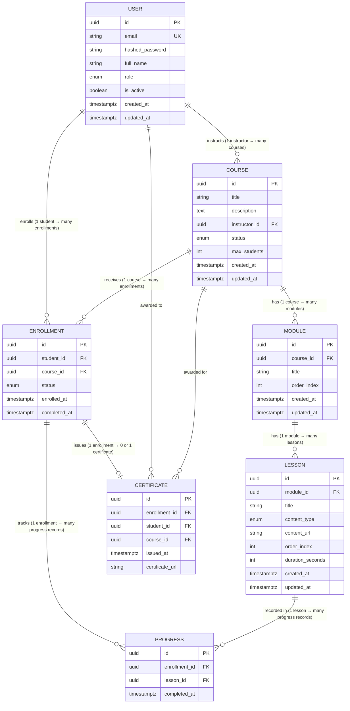

# SmartCourse — Database Schema

## Entity Relationship Diagram



---

## Hierarchy Flow

```
USER (role: instructor)
 │
 │ creates
 ▼
COURSE (status: draft → published → archived)
 │   max_students (enrollment cap)
 │
 │ contains (CASCADE delete)
 ▼
MODULE (order_index — position within course)
 │
 │ contains (CASCADE delete)
 ▼
LESSON (order_index — position within module)
 │       content_type: video | text | pdf
 │       content_url → file on S3/CDN
 │
 └─────────────────────────────────────┐
                                       │
USER (role: student)                   │
 │                                     │
 │ enrolls in                          │
 ▼                                     │
ENROLLMENT ──────── UNIQUE(student_id, course_id)
 │  status: active → completed → dropped
 │  completed_at (set when all lessons done)
 │
 │ tracks (CASCADE delete)             │
 ▼                                     │
PROGRESS ◄─────────────────────────────┘
 │  UNIQUE(enrollment_id, lesson_id)
 │  completed_at
 │
 │ when all lessons complete
 ▼
CERTIFICATE
    enrollment_id (RESTRICT — legal record)
    student_id    (denormalized — stands independently)
    course_id     (denormalized — stands independently)
```

---

## Cascade Rules

```
COURSE deleted
├── RESTRICT  → blocked if enrollments exist
├── CASCADE   → modules deleted automatically
│       └── CASCADE → lessons deleted automatically
│                       └── RESTRICT → blocked if progress records exist
└── RESTRICT  → blocked if certificates exist

USER deleted
├── RESTRICT → blocked if enrollments exist
├── RESTRICT → blocked if certificates exist
└── RESTRICT → blocked if courses exist (instructor)

ENROLLMENT deleted
└── CASCADE → progress records deleted automatically

LESSON deleted
└── RESTRICT → blocked if progress records exist
```

---

## Enum Reference

| Enum | Values |
|---|---|
| `UserRole` | `student` · `instructor` · `admin` |
| `CourseStatus` | `draft` · `published` · `archived` |
| `ContentType` | `video` · `text` · `pdf` |
| `EnrollmentStatus` | `active` · `completed` · `dropped` |

---

## Indexes

| Table | Index | Purpose |
|---|---|---|
| `courses` | `idx_courses_instructor_id` | Find all courses by an instructor |
| `courses` | `idx_courses_status` | Filter published courses |
| `courses` | `idx_courses_search` (GIN) | Full-text search on title + description |
| `modules` | `idx_modules_course_order` | List modules in order for a course |
| `lessons` | `idx_lessons_module_order` | List lessons in order for a module |
| `enrollments` | `idx_enrollments_student_id` | Find all enrollments for a student |
| `enrollments` | `idx_enrollments_course_id` | Find all enrollments for a course |
| `enrollments` | `idx_enrollments_student_status` | Active enrollments for a student |
| `progress` | `idx_progress_enrollment_id` | All progress records for an enrollment |

---

## Unique Constraints

| Table | Constraint | Reason |
|---|---|---|
| `users` | `email` | No duplicate accounts |
| `modules` | `(course_id, order_index)` | No two modules at the same position |
| `lessons` | `(module_id, order_index)` | No two lessons at the same position |
| `enrollments` | `(student_id, course_id)` | No duplicate enrollments |
| `progress` | `(enrollment_id, lesson_id)` | No duplicate lesson completion |
| `certificates` | `enrollment_id` | One certificate per enrollment |

---

## Storage Boundaries

```
PostgreSQL (this schema)
└── source of truth for all structured, relational data

MongoDB (Week 2 onwards)
└── lesson_chunks — raw text extracted during publishing workflow
    Week 4: embedding vectors added to same documents

Redis
└── caching, session data, Celery result backend

Kafka
└── event streaming between services (Week 3)
```
